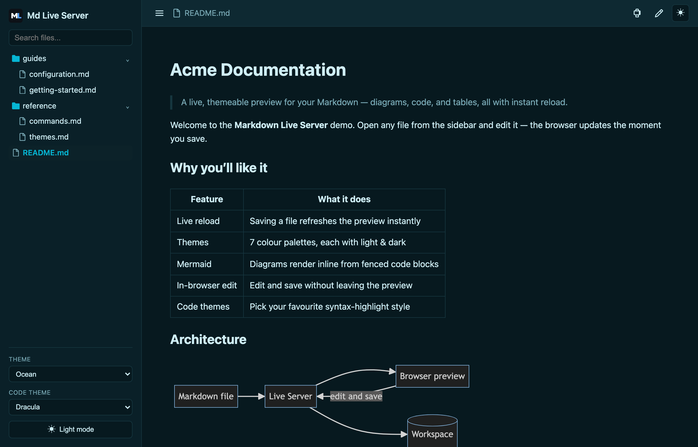
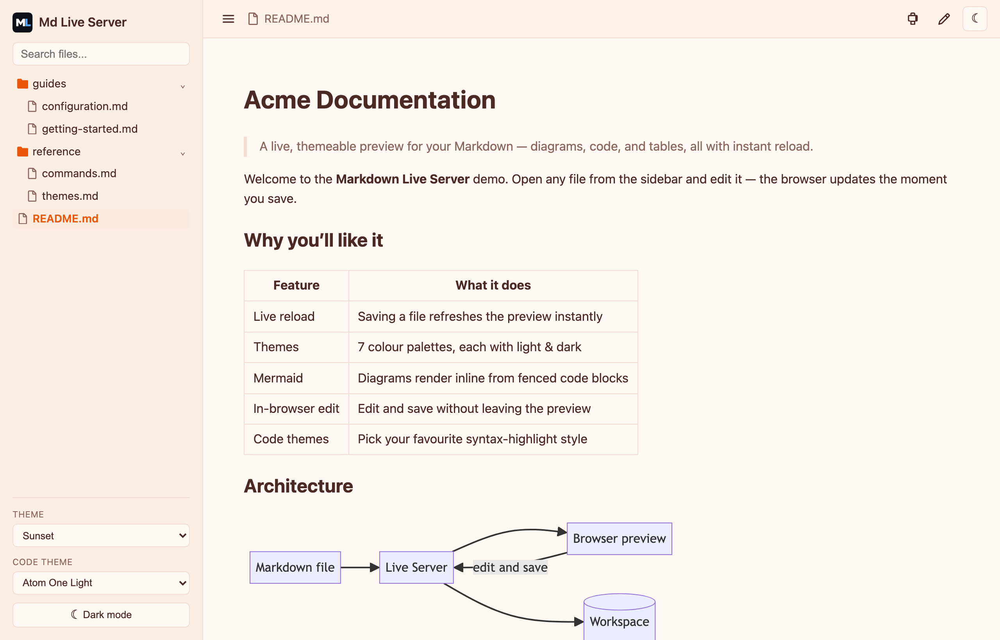
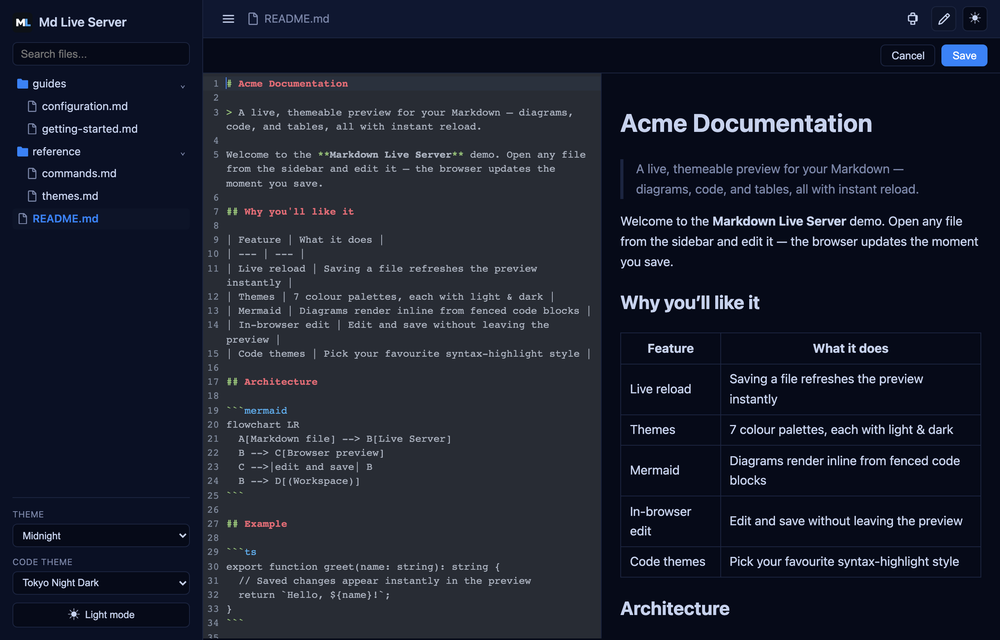
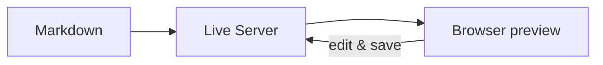
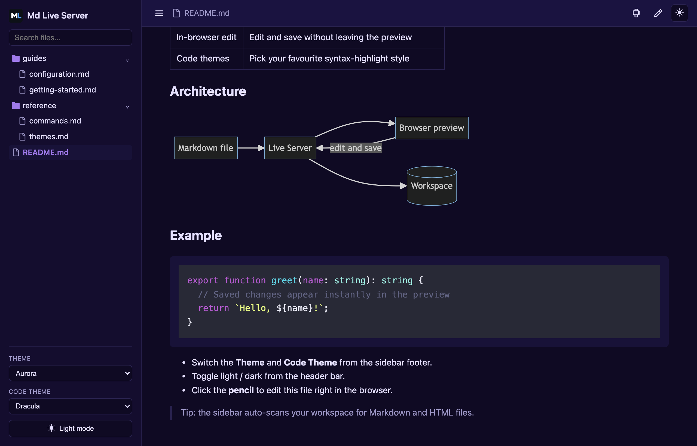

# Markdown Live Server

**A fast, themeable live preview for Markdown — Mermaid diagrams, syntax‑highlighted code, and in‑browser editing, right from VS Code.**

---

Start a local server from VS Code and preview your Markdown in the browser. The page reloads the instant you save, Mermaid diagrams and code render beautifully, and you can switch themes or edit the file right in the page.

## ✨ Highlights

- **⚡ Live reload** — save any file and the browser updates instantly.
- **📊 Mermaid diagrams** — fenced `mermaid` blocks render inline.
- **🌈 Syntax highlighting** — choose from many code themes (GitHub, Dracula, Nord, Tokyo Night, and more).
- **🎨 7 themes × light/dark** — Aurora, Forest, Ghibli, Midnight, Modern, Ocean, Sunset.
- **📝 In‑browser editing** — edit Markdown in a CodeMirror editor with live preview; saving writes back to disk (local only).
- **🗂️ Project sidebar** — auto‑scans your workspace for Markdown/HTML with search, folder/file icons, and active‑file highlighting.
- **🖨️ Print** — one click to print just the document.
- **📡 LAN sharing** — the preview is reachable from other devices on your network (read‑only).
- **🔌 Configurable port** — defaults to `4400` with automatic fallback to the next free port.

## 🎨 Themes & dark mode

Pick a **Theme** and **Code Theme** from the sidebar, and toggle light/dark from the header bar. Seven palettes, each with a light and a dark variant — your choice is remembered.

<table>
  <tr>
    <td width="50%"></td>
    <td width="50%"></td>
  </tr>
  <tr>
    <td align="center"><em>Ocean · dark</em></td>
    <td align="center"><em>Sunset · light</em></td>
  </tr>
</table>

## 📝 Edit in the browser

Click the **pencil** in the header to open a split CodeMirror editor with a live preview. Saving writes the changes back to the file on disk — and, for safety, only works when you're viewing from `localhost` / `127.0.0.1`.

## 🧩 Diagrams & code

Fenced `mermaid` blocks render as diagrams, and code blocks are syntax‑highlighted with your chosen code theme.

## 🚀 Getting started

1. Install from the Marketplace, or run `code --install-extension tuld01061.md-live-server`.
2. Open a folder or a Markdown file in VS Code.
3. Start the server — any of:
   - Command Palette → **Markdown Live Server: Start Markdown Live Server**
   - Right‑click a file or folder in the Explorer → **Start Markdown Live Server**
   - Click the status bar item.
4. Your browser opens the preview. Edit and save — it reloads automatically.
5. Stop from the status bar item or **Stop Markdown Live Server**.

## ⚙️ Settings

| Setting | Default | Description |
| --- | --- | --- |
| `mdLiveServer.port` | `4400` | Preferred server port; falls back to the next free port if it's busy. |
| `mdLiveServer.siteMenu.enabled` | `true` | Show the project sidebar. |
| `mdLiveServer.siteMenu.include` | `["*"]` | Glob patterns for files to include in the sidebar. |
| `mdLiveServer.siteMenu.exclude` | `[".*", "node_modules"]` | Glob patterns to exclude from the sidebar. |

## ⌨️ Commands

| Command | Description |
| --- | --- |
| `Markdown Live Server: Start Markdown Live Server` | Start the server and open the browser. |
| `Markdown Live Server: Stop Markdown Live Server` | Stop the current server. |
| `Markdown Live Server: Toggle Markdown Live Server` | Start or stop the server. |

## 📦 Notes

- Markdown files and directory index pages render with the sidebar and live reload.
- Static assets (images, CSS, JS, HTML) are served from your workspace root.
- The server binds to your LAN so other devices can view previews; **editing and saving are restricted to `localhost`**.

## License

[MIT](LICENSE)
