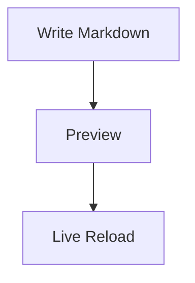

# Markdown Live Server

Preview Markdown, Mermaid diagrams, and static web files from VS Code with local live reload.

## Features

- Start a local server from editor, Explorer, command palette, or status bar.
- Render Markdown files as styled HTML.
- Render Mermaid code blocks.
- Reload browser automatically when files change.
- Serve images, CSS, JavaScript, and other static files from workspace.
- Switch rendered Markdown between light and dark themes.

## Usage

1. Open a workspace, folder, or file in VS Code.
2. Run `Markdown Live Server: Start Markdown Live Server` from command palette.
3. Or right-click a file/folder and choose `Start Markdown Live Server`.
4. Browser opens at a local `127.0.0.1` URL.
5. Edit Markdown or static files; browser updates automatically.
6. Use status bar item or `Markdown Live Server: Stop Markdown Live Server` to stop server.

## Mermaid

Use fenced code blocks with `mermaid` language:

```markdown

```

## Commands

| Command | Description |
| --- | --- |
| `Markdown Live Server: Start Markdown Live Server` | Start server and open browser. |
| `Markdown Live Server: Stop Markdown Live Server` | Stop current server. |
| `Markdown Live Server: Toggle Markdown Live Server` | Start or stop server from status bar. |

## Requirements

- VS Code 1.90.0 or newer.
- Internet access for Mermaid rendering via jsDelivr CDN.

## Extension settings

No settings yet. Server uses an available local port on `127.0.0.1`.

## Privacy and security

Markdown Live Server serves files from your selected workspace or folder on `127.0.0.1` only. It does not send workspace files to external services. Mermaid diagrams load the Mermaid library from jsDelivr CDN in the preview page.

## Development

```bash
npm install
npm run compile
```

Press `F5` in VS Code to launch an Extension Development Host.

Package for Marketplace:

```bash
npm run package
```

Publish after setting a VS Marketplace publisher token:

```bash
npm run publish
```

## License

MIT
