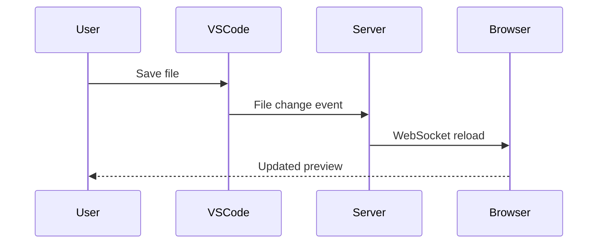
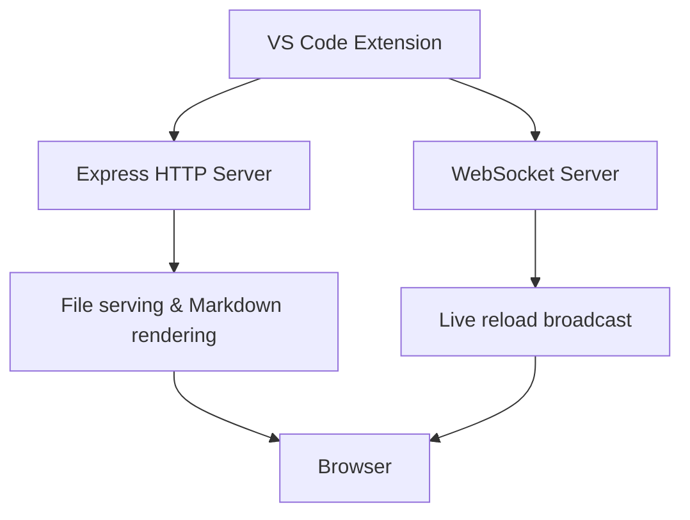
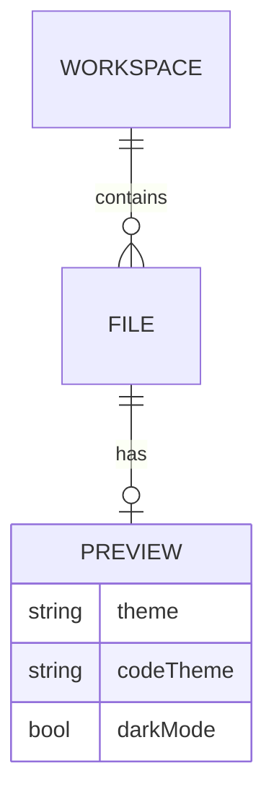

# Mermaid Diagrams

Fenced `mermaid` blocks render as interactive diagrams.

## Flowchart

```mermaid
flowchart LR
  A[Markdown] --> B[Live Server]
  B --> C[Browser preview]
  C -->|edit & save| B
```

## Sequence Diagram

```mermaid
sequenceDiagram
  participant User
  participant VSCode
  participant Server
  participant Browser

  User->>VSCode: Save file
  VSCode->>Server: File change event
  Server->>Browser: WebSocket reload
  Browser-->>User: Updated preview
```

## Architecture

```mermaid
flowchart TD
  A[VS Code Extension] --> B[Express HTTP Server]
  A --> C[WebSocket Server]
  B --> D[File serving & Markdown rendering]
  C --> E[Live reload broadcast]
  D --> F[Browser]
  E --> F
```

## Entity Relationship

```mermaid
erDiagram
  WORKSPACE ||--o{ FILE : contains
  FILE ||--o| PREVIEW : has
  PREVIEW {
    string theme
    string codeTheme
    bool darkMode
  }
```
