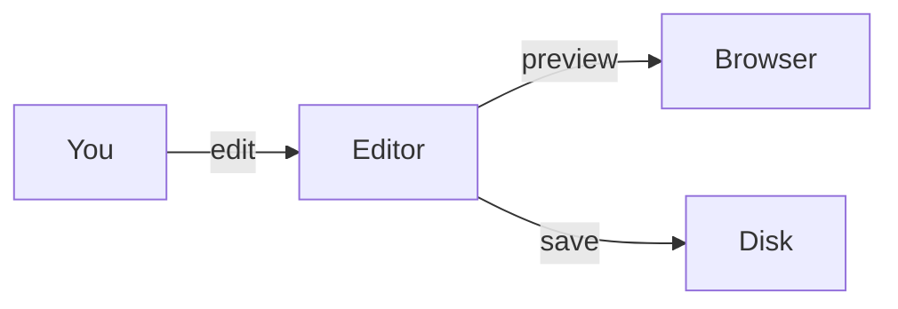

# In‑Browser Editor

Click the **pencil icon** in the header bar to open a split CodeMirror editor alongside the live preview.

## How it works

- The left pane shows a **CodeMirror editor** with Markdown syntax highlighting.
- The right pane shows the **live preview** — updates as you type.
- **Save** (Ctrl/Cmd+S) writes the changes back to the file on disk.
- Saving is restricted to `localhost` / `127.0.0.1` for safety.

## Try editing below

This paragraph is a great candidate for editing in the browser. Open the editor, change some text, and watch the preview update in real time.

### A sample list to modify

- Item one
- Item two
- Item three — try changing this!

### A sample table to expand

| Name | Role | Status |
| --- | --- | --- |
| Alice | Author | Active |
| Bob | Reviewer | Pending |

### A Mermaid diagram to tweak

> **Tip:** The editor uses CodeMirror 6 with Markdown mode. Standard keyboard shortcuts work: Ctrl+Z to undo, Ctrl+A to select all.
